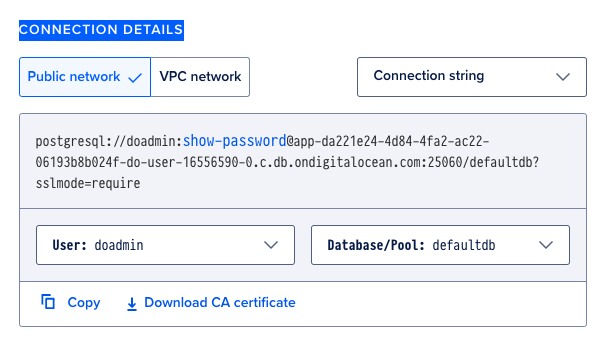

# How to deploy your app to the Digital Ocean

❗ATTENSION: Don't forget to provide proper values, ports, IP address, DSN etc.

There are two ways how to deploy Golang apps to DO. Despite the way you choose, you need Postgres, so create managed Postgres on DO according this [quickstart](https://docs.digitalocean.com/products/databases/postgresql/getting-started/quickstart/).
1. Choose Frankfurt as a datacenter region.
1. Select the cheapest plan.
1. On the page of created database cluster you can retrieve connection information.

1. Using this connection settings you can connect to DB using Datagrip or similar tool.

## Apply migrations.
1. Run migrations from your local machine `migrate -path=./path/to/migrations -database="dsn_from_digital_ocean" up`

## Uploading binary
1. Create the cheapest droplet with the latest Ubuntu using password or SSH key. Here is the [manual](https://docs.digitalocean.com/products/droplets/how-to/create/).
1. Get DB DSN string
1. Build Use command `GOARCH=amd64 GOOS=linux go build -o app-linux ./path/to/your/app/entry/point` because we need binary for Linux. (-o means output)
1. Upload prebuilt app from your machine to new created Droplet using `scp ./built-file root@your-server-ip:/root`.
1. Set your binary executable `chmod -x ./app-linux`
1. Run built app locally using `-dsn` flag `./app-linux -dsn "dsn_string_from_digital_ocean"`. And, you can provide other flags.
1. Try to check access to your app using Droplet IP address. E.g., `http://100.200.300.400:8080/api/v1/healthcheck`.
