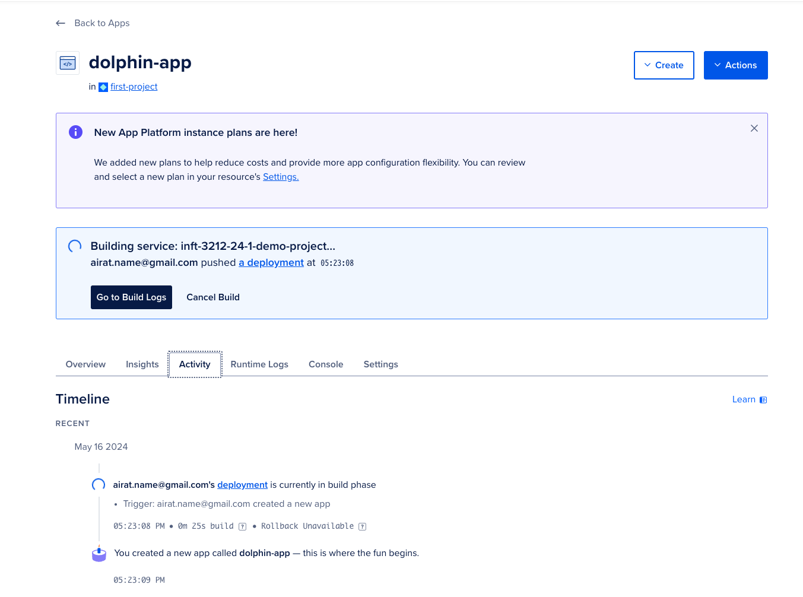

# How to deploy your app to the Digital Ocean (DO).

❗ATTENTION: Don't forget to provide proper values, ports, IP address, DSN etc.

❗ATTENTION 2: Use free 200$ credits in DO using this button at the end of the main page.


## Content
There are two ways how to deploy Golang apps to DO. Despite the way you choose, you need Postgres, so create managed Postgres on DO according this [quickstart](https://docs.digitalocean.com/products/databases/postgresql/getting-started/quickstart/).

1. Choose Frankfurt as a datacenter region.
1. Select the cheapest plan.
1. On the page of created database cluster you can retrieve connection information.
   
1. Using this connection settings you can connect to DB using Datagrip or similar tool.

## Apply migrations.

1. Run migrations from your local machine `migrate -path=./path/to/migrations -database="dsn_from_digital_ocean" up`

## Uploading binary

1. Create the cheapest droplet with the latest Ubuntu using password or SSH key. Here is the [manual](https://docs.digitalocean.com/products/droplets/how-to/create/).
1. Get DB DSN string
1. Build Use command `GOARCH=amd64 GOOS=linux go build -o app-linux ./path/to/your/app/entry/point` because we need binary for Linux. (-o means output)
1. Upload prebuilt app from your machine to new created Droplet using `scp ./built-file root@your-server-ip:/root`.
1. Set your binary executable `chmod -x ./app-linux`
1. Run built app locally using `-dsn` flag `./app-linux -dsn "dsn_string_from_digital_ocean"`. And, you can provide other flags.
1. Try to check access to your app using Droplet IP address. E.g., `http://100.200.300.400:8080/api/v1/healthcheck`.

## Using app platform with Docker image.

1. Go to App platform page in DO.
1. Press Create App.
1. Select service provide Github.
1. Allow all needed access.
1. Select proper repository, branch and folder. For demo-app it is main and `/`.
1. Keep autodeploy checked.
1. Configure resources. (NOTE❗: delete one of web services, leave only one)
   
1. Add and configure previously created database.
   
   
1. Configure DSN and press Save. (NOTE ❗: your app should read envs like in demo app)
   
1. Choose Frankfurt in Region select.
1. Review everything, then submit. 
1. Wait for building.
   
1. Check given URL with your params, https://dolphin-app-qdx7b.ondigitalocean.app/api/v1/healthcheck.
1. Hooray! 🎉


## Run binary in background (Optional)

### Configure as a System Service
For a more robust setup, especially for production environments, you might want to configure your application to run as a system service using systemd. Here’s how you can do it:

1. Create a systemd service file:

```bash
sudo nano /etc/systemd/system/your_service_name.service
```

2. Add the following configuration to the file:

```ini
[Unit]
Description=Go Application Service
After=network.target

[Service]
User=username
Group=usergroup
ExecStart=/path/to/directory/binary_name
EnvironmentFile=/path/to/directory/.env
Restart=always

[Install]
WantedBy=multi-user.target
```

Replace `your_service_name` with a name for your service, `username` and `usergroup` with the user and group under which the service should run, and adjust the `ExecStart` path to point to your binary.

In our case it should look like this.
```ini
User=root
Group=root
ExecStart=/root/binary_name
ExecStart=/root/.env
```

Don't forget to create `.env` file with proper values.
```bash
touch .env
nano .env
```
`.env` example
```
DSN=path_to_DSN
PORT=8080
```

3. Reload systemd to read the new service file:

Add `sudo` if user is not `root`.

```bash
systemctl daemon-reload
```

4. Start the service:

```bash
systemctl start your_service_name.service
```

5. Enable the service to start on boot:

```bash
systemctl enable your_service_name.service
```

6. Check the status of your service:

```bash
systemctl status your_service_name.service
```

This will ensure that your Go application starts automatically at boot and restarts if it ever crashes.

### Step 5: Monitor and Maintain
Ensure to monitor the application logs and system performance. You can check logs of a systemd service with:

```bash
journalctl -u your_service_name.service
```

This setup provides a basic foundation for running a Go application on a server, ensuring it's secure, stable, and restarts automatically if needed.

Thanks for ChatGPT 🤖 for base instruction that I have modified a bit. :)