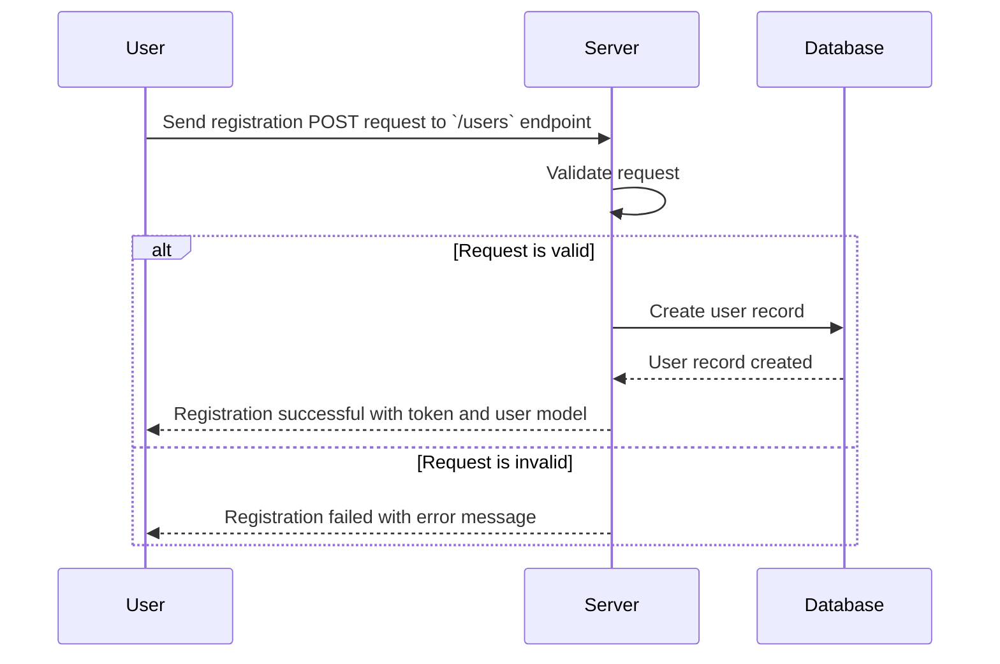
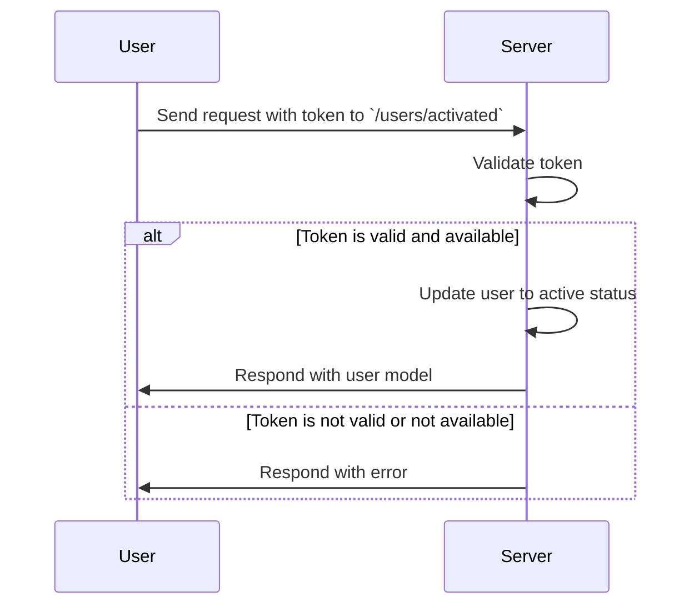

# Authentication flow

## Registration flow outline

```mermaid
sequenceDiagram
    participant User
    participant Server
    participant Database

    User->>Server: Send registration POST request to `/users` endpoint
    Server->>Server: Validate request
    alt Request is valid
        Server->>Database: Create user record
        Database-->>Server: User record created
        Server-->>User: Registration successful with token and user model
    else Request is invalid
        Server-->>User: Registration failed with error message
    end
```

## User Activation flow outline

```mermaid
sequenceDiagram
    participant User
    participant Server

    User->>Server: Send request with token to `/users/activated`
    Server->>Server: Validate token
    alt Token is valid and available
        Server->>Server: Update user to active status
        Server->>User: Respond with user model
    else Token is not valid or not available
        Server->>User: Respond with error
    end
```
